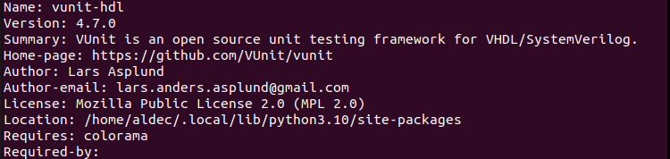
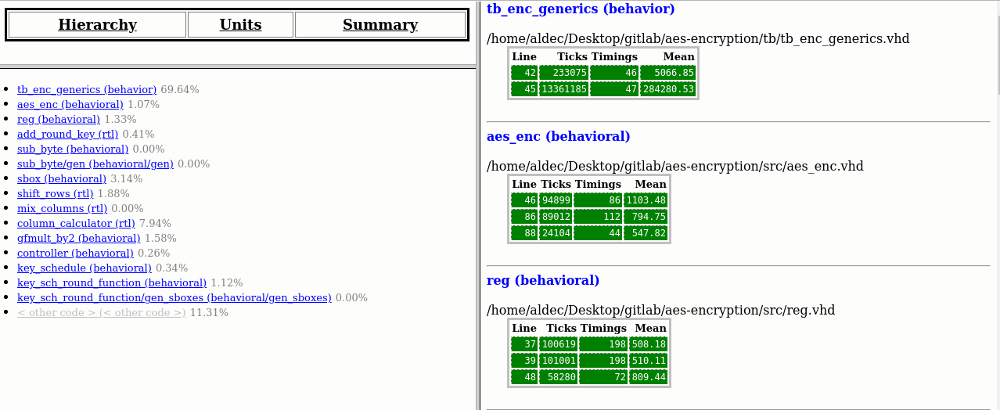
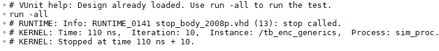
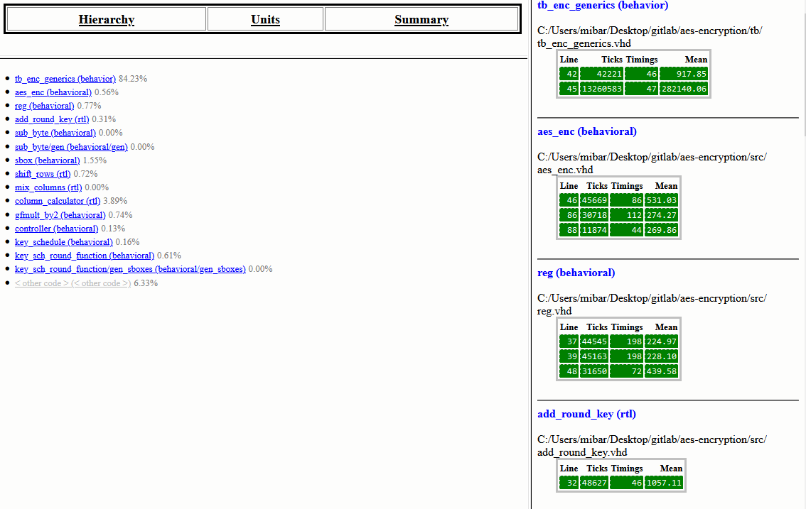

# AES Encryption

## 1. Requirements

* Riviera-PRO 2024.04
* Python 3.7 or higher
* Ubuntu 2022.04

OR

* Active-HDL 15.0
* Python 3.7 or higher
* Windows 10

## 2. Installation Python Packages

Install necessary packages using steps below:

**2.1.** pip install vunit_hdl

**2.2.** pip install pycryptodome

## 3. Running an Example

### 3.1 Running with Riviera-PRO

Set up the environment variable and run the example following steps below:

**3.1.1.** cd aes_encryption

**3.1.2.** export PATH=<Riviera-PRO_installation_directory>/bin:$PATH

**3.1.3.** python3 run.py

**Figure 1:** Console view after running test with Riviera-PRO.

To run example with multiple threads use -p option following by the thread nubmer.

**3.1.4.** python3 run.py -p <thread_number>

**Figure 2:** Console view after running test with Riviera-PRO using five threads.

### 3.2 Running with Active-HDL

Set up the environment varable and run the example following steps below:

**3.2.1** cd aes_encryption

**3.2.2** set PATH=<Active-HDL_installation_directory>\bin:%PATH%

**3.2.3** python run.py

**Figure 3:** Console view after running test with Active-HDL.

To run example with multiple threads firstly patch need to be applied. Find the vunit_hdl package location.

**3.2.4** pip show vunit_hdl

**Figure 4:** VUnit Package location in Windows OS.

Replace the 'activehdl.py' in <vunit_hdl_location>/vunit_sim_if with the file aes-encryption/patch/activehdl.py. After replacement of the patch file use -p option following by the thread number to run the example with multiple threads.

**3.2.5** python run.py -p <thread_number>

**Figure 5:** Console view after running test with Active-HDL using five threads.

## 4. Logic Data Profiling

### 4.1. Using Riviera-PRO Logic Data Profiler

To use logic data profiler with Riviera-PRO apply the necessary patch and generate profiler report. Following steps will guide you through the whole process starting from localize vunit_hdl package and replacing necessary files.

**4.1.1.** pip show vunit_hdl

**Figure 6:** Vunit Package location in Unix OS.

**4.1.2.** Replace files named 'factory.py' and 'rivierapro.py' in <vunit_hdl_location>/vunit/sim_if with the files 'factory.py' and 'rivierapro.py' from aes-encryption/patch directory.

**4.1.3.** Uncomment line 92nd in run.py script to enable logic profiler

**Figure 7:** Uncommented line with enabled Data Profiling.

**4.1.4.** Run the run.py script to generate profiler output files

python3 run.py

**4.1.5.** Run the Riviera-PRO simulator in aes-encryption directory

**4.1.6.** In the Riviera-PRO console type below command to generate profiler report

profiler report -tbp $curdir/vunit_out/test_output/<specific_test_directory>/rivierapro/Profiler/profiler.tbp -html <profiler_report_name>.html

Profiler Report will be stored in the aes-encryption directory.

**4.1.7.** Open Profiler Report file for review the profiling results

**Figure 8:** Example Profiler Report in Riviera-PRO.

### 4.2 Using Active-HDL Logic Data Profiler

To use logic data profiler with Active-HDL apply the necessary patch and generate profiler report. Following steps will guide you through the whole process starting from localize vunit_hdl package and replacing necessary files. 

**4.2.1.** pip show vunit_hdl

**Figure 9:** Vunit Package location in Windows OS.

**4.2.2.** Replace files named 'factory.py' and 'activehdl.py' in <vunit_hdl_location>/vunit/sim_if with the files 'factory.py' and 'activehdl.py' from aes-encryption/patch directory.

**4.2.3.** Uncomment line 92nd in run.py script to enable logic profiler

**Figure 10:** Uncommented line with enabled Data Profiling.

**4.2.4.** Run the run.py script in GUI mode

python run.py -g

**4.2.5.** Run the VUnit simulation via Active-HDL console

run -all

**Figure 11:** Running Vunit simulation in Active-HDL.

**4.2.6** Stop the simulation to obtain Profiler results

endsim

**Figure 12:** Stopping VUnit sinulation in Active-HDL.

**4.2.7.** In the Active-HDL console type the following command to generate profiler report:

profiler report -tbp $dsn/../../../Profiler/profiler.tbp -html $dsn/../../../Profiler/<profiler_report_name>.html

Profiler Report will be stored in the aes-encryption/vunit_out/test_output/<specific_test_directory>/Profiler directory.

**4.2.8.** Open Profiler Report file for review the profiling results

**Figure 13:** Example Profiler Report in Active-HDL.
