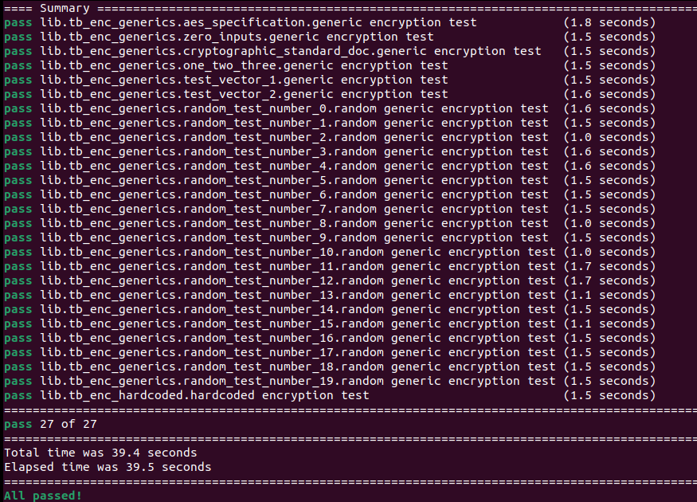
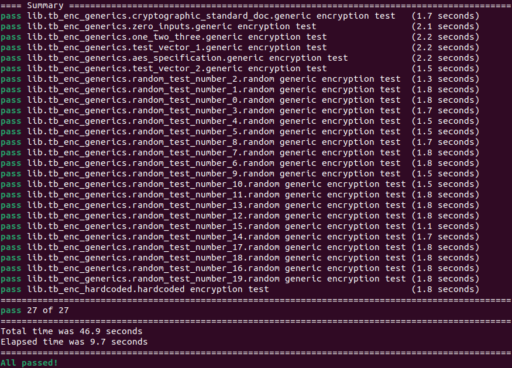
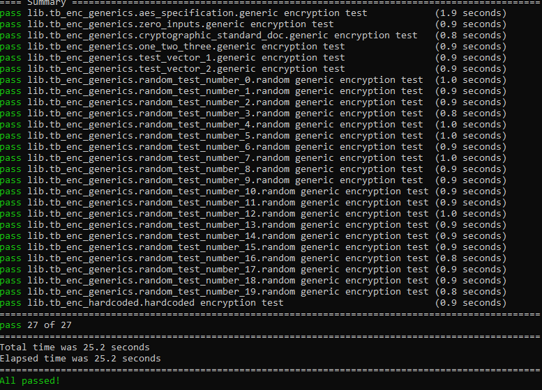
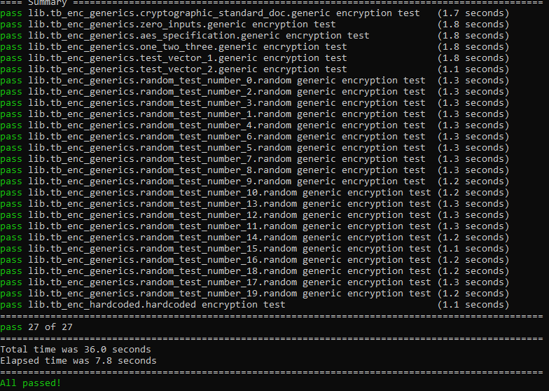

# AES Encryption

## 1. Requirements

* Riviera-PRO 2024.04
* Python 3.7 or higher
* Ubuntu 2022.04

OR

* Active-HDL 15.0
* Python 3.7 or higher
* Windows 10

### Verified with:

 - VUnit 4.7.0, Riviera-PRO 2024.04-x64, Ubuntu 22.04.4/24.04.1 LTS and Python 3.10.11/3.11.10/3.12.3
 
 - VUnit 4.7.0, Active-HDL 15.0-x64, Windows 10/11 and Python 3.12.4/3.12.6.

## 2. Installation Python Packages

Install necessary packages using command below:

**2.1.** ```pip install -r requirements.txt```

## 3. Running an Example

### 3.1 Running with Riviera-PRO

Set up the environment variable and run the example following steps below:

**3.1.1.** ```cd aes_encryption```

**3.1.2.** ```export PATH=<Riviera-PRO_installation_directory>/bin:$PATH```

**3.1.3.** ```python3 run.py```



**Figure 1:** Console view after running test with Riviera-PRO.

To run example with multiple threads use -p option following by the thread nubmer.

**3.1.4.** ```python3 run.py -p <thread_number>```



**Figure 2:** Console view after running test with Riviera-PRO using five threads.

### 3.2 Running with Active-HDL

Set up the environment varable and run the example following steps below:

**3.2.1** ```cd aes_encryption```

**3.2.2** ```set PATH=<Active-HDL_installation_directory>\bin:%PATH%```

**3.2.3** ```python run.py```



**Figure 3:** Console view after running test with Active-HDL.

To run example with multiple threads firstly patch need to be applied. Find the vunit_hdl package location.

**3.2.4** ```pip show vunit_hdl```


**Figure 4:** VUnit Package location in Windows OS.

Replace the 'activehdl.py' in <vunit_hdl_location>/vunit_sim_if with the file aes-encryption/patch/activehdl.py. After replacement of the patch file use -p option following by the thread number to run the example with multiple threads.

**3.2.5** ```python run.py -p <thread_number>```



**Figure 5:** Console view after running test with Active-HDL using five threads.

## 4. Coveraging

### 4.1. Using Active-HDL/Riviera-PRO Coverage 

To use coverage (statement and branch) with Active-HDL/Riviera-PRO following arguments added to the run.py:

lib.set_compile_option("activehdl.vcom_flags", ["-coverage","sb"])
lib.set_sim_option("activehdl.vsim_flags", ["-acdb_cov sb"])
or 
lib.set_compile_option("rivierapro.vcom_flags", ["-coverage","sb"])
lib.set_sim_option("rivierapro.vsim_flags", ["-acdb_cov sb"])

### 4.2 Collecting and Merging Coverage data

To summariuse coverage data please execute enclosed acdb.do script after VUnit:

Active-HDL:
vsim -c -tcl acdb.do; quit
Riviera-PRO
vsim -c -do acdb.do; quit

As a result all acdb files will be merged and html reports will be generated withion /acdb subfolder.

## 5. Contribution tests

To run only necessary tests please define environment variable: 
CONTRIBUTRION

If variable is equal to 1 the list of tests form contribution.txt file will be only executed.
Previously generated /acdb/rank.html report can be used as a source of contributed test list.

For more info about other coverages like assertion, expression, conditional or FSM, verification plan etc. please refer directly to Active-HDL/Riviera-PRO documentation.
