# AES-ENC VHDL

This example project demonstrates the use of VUnit, a unit testing framework, in conjunction with Aldec's simulators: Active-HDL and Riviera-PRO. In this project, you will find valuable information on:

 - Understanding VUnit, Riviera-PRO, and Active-HDL
 - Creating designs that work seamlessly with VUnit
 - Integrating VUnit with Riviera-PRO or Active-HDL
 - Exploring the benefits of using these tools together
 - Step-by-step guidelines for running and customizing the provided example

<div align="center" width="100%">
  
  
  
</div>

The source files for this project are available [here](https://github.com/hadipourh/AES-VHDL). This link also includes useful guidelines and additional details about the example.

### Verified with:

 - VUnit 4.7.0, Riviera-PRO 2024.04-x64, Ubuntu 22.04.4/24.04.1 LTS and Python 3.10.11/3.11.10/3.12.3
 
 - VUnit 4.7.0, Active-HDL 15.0-x64, Windows 10/11 and Python 3.12.4/3.12.6.

# Tools Description

## VUnit

VUnit is an open-source unit testing framework for VHDL/SystemVerilog, released under the Mozilla Public License, v. 2.0. It provides the necessary tools for continuous and automated testing of HDL code, complementing traditional testing methodologies by promoting a “test early and often” approach through automation.

For more information, visit the official [VUnit website](https://vunit.github.io/about.html#about) or explore the VUnit-related blogs on Aldec's website. Currently, there is a series of three blogs:

- [Introduction to VUnit](https://www.aldec.com/en/company/blog/195--introduction-to-vunit)
- [Speeding Up Simulation with VUnit for Parallel Testing](https://www.aldec.com/en/company/blog/196--speeding-up-simulation-with-vunit-for-parallel-testing)
- [Navigating VUnit: A Practical Guide to Modifying Testing Approaches](https://www.aldec.com/en/company/blog/197--navigating-vunit-a-practical-guide-to-modyfing-testing-approaches)

## Riviera-PRO

Riviera-PRO™ addresses the verification needs of engineers developing cutting-edge FPGA and SoC devices. It enhances testbench productivity, reusability, and automation through a high-performance simulation engine, advanced debugging capabilities at various abstraction levels, and support for the latest Language and Verification Library Standards.

To learn more about the benefits of using Riviera-PRO, visit [this page](https://www.aldec.com/en/products/functional_verification/riviera-pro).

## Active-HDL

Active-HDL™ is a Windows® based, integrated FPGA design creation and simulation solution for team-based environments. Active-HDL’s integrated design environment (IDE) includes a full HDL and graphical design tool suite and RTL/gate-level mixed-language simulator for rapid deployment and verification of FPGA designs.

If you are hungry for more information please visit [this website](https://www.aldec.com/en/products/fpga_simulation/active-hdl).

# What is the AES?

AES, or Advanced Encryption Standard, is a symmetric block cipher used for encrypting data in fixed-size blocks to produce ciphertext using a cryptographic key and algorithm. AES processes plaintext through multiple encryption rounds, splitting the message into 128-bit blocks, known as ciphertext. As a symmetric encryption algorithm, AES uses the same key for both encryption and decryption.

For more information about AES, visit [this page](https://en.wikipedia.org/wiki/Advanced_Encryption_Standard).

# Project Content

The project consists of:

- source files: placed in src directory, they are all written in VHDL, contains AES encryption procedure, the top module is aes_enc.vhd.

- testbenches: placed in tb directory, written in VHDL, there are two different files depends on testing approach, tb_enc_hardcoded.vdh file is for hardcoded test case and tb_enc_generics.vhd file is used with randomized and not randomized generics-based test cases.

- Input data randomization script: rand_enc.py, used for create and randomize cipher key and plaintext, and calculation of expected ciphertext for comparison procedure. 

- Python run-script: file named 'run.py', responsible for adding project sources to a library, running different test cases, setting simulation flags and running VUnit main function.

- Patch scripts: file named 'activehdl.py', necessary for proper work of multithreading operations in Active-HDL. Should be replacement for 'activehdl.py' file in vunit_hdl library directory (Windows only).

# Example Description

## Techniques and Encryption Process

This AES algorithm implementation is based on [this book][1]. It leverages two well-known hardware implementation techniques: pipelining and loop-unrolling. In this example, the loop-unrolling technique is applied. You can learn more about loop-unrolling on this [Wikipedia page](https://en.wikipedia.org/wiki/Loop_unrolling).

For each round of AES encryption, a different sub-key is used as the round key, which is produced by the keyschedule algorithm. There is a dedicated part implementing keyschedule algorithm based on the loop-unrolled technique, to produce the required sub-key for each round on the fly. The AES encryption process is illustrated in the following diagram:

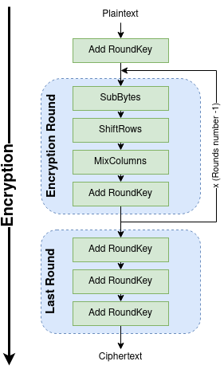

For more information on the encryption process and the project architecture, visit the project [GitHub page](https://github.com/hadipourh/AES-VHDL).

## Multicore Simulation

Understanding the VUnit workflow is crucial for grasping the functionality of this example. The following diagram offers an overview of the process:


VUnit integrates with Aldec's simulators (Active-HDL and Riviera-PRO) through its Python plumbing, which includes the library and testbench API, simulator interfaces, and a runner for interacting with HDL testbenches. VUnit also provides optional HDL libraries and third-party resources, accessible via the built-ins API. The core and built-ins are part of VUnit's public Python Interface. For optional libraries, refer to the [HDL Libraries](https://vunit.github.io/hdl_libraries.html#hdl-libraries).

One of the key advantages of using VUnit is its support for multicore simulations, as demonstrated in this example. The diagram below highlights how multithreading improves performance in this implementation:


The tests consist of multiple testbench files, where VHDL or SV processes are organized into smaller test cases. These test cases can run concurrently on multiple threads, enabling simultaneous data calculation and significantly improving testing and simulating performance. The testbench code often employs multiple concurrent processes to achieve various objectives. These processes can operate independently or require synchronization to coordinate their actions. Slow I/O operations might block simulation threads, causing the operating system to switch to another thread. In such scenarios, introducing additional threads can enhance performance.

## Example Workflow

This example demonstrates three different approaches of initializing input data and checking the correctness of the encryption process:

1. Hardcoded Test: In this approach, input data such as the cipher key, plaintext, and expected output ciphertext are hardcoded. There is only one test case in the design.

2. Generics-Based Tests: This approach enhances input data by using VHDL generics. In the example, there are six test cases, each requiring unique data provided manually.

3. Randomized Generics-Based Tests: This fully automated method uses randomized inputs and a Python reference package, executing 20 tests by default.

The following diagram outlines the workflow of this example:

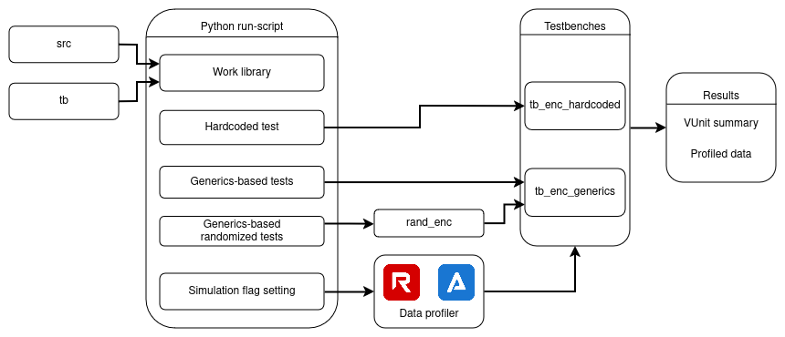

1. Source Inputs:

    The process begins with two source directories: src (source files) and tb (testbench files).

2. Python Run-Script:

    These inputs are processed by a Python run-script, which manages and orchestrates various testing tasks:

   - Work Library: The source files (src) and testbench files (tb) are compiled into a work library.
   - Hardcoded Test: This involves running predefined tests.
   - Generics-Based Tests: These are tests that use generic parameters, allowing for more flexible and reusable test scenarios.
   - Generics-Based Randomized Tests: Similar to generics-based tests, but with added randomization to cover a wider range of scenarios and increase test coverage.
   - Simulation Flag Setting: This step configures various simulation flags to control the behavior and output of the test runs.

3. Data Profiler:

    The Python run-script interfaces with a data profiler tool, which collects performance and profiling data during the test runs. The data profiler uses one of the Aldec's simulator at a time.

4. Testbenches:

    The organized tests from the Python run-script are executed within specific testbenches:
   - tb_enc_hardcoded: Executes the hardcoded tests.
   - tb_enc_generics: Executes the generics-based tests.
   - rand_enc: Makes generics-based tests randomized, and modyfies the input data to appropriate format, uses Python pycryptodome library.

5. Results:

    The outputs from the testbenches are compiled into a results container, which includes:
   - VUnit Summary: A summary of the test results, generated by VUnit, and displayed in the console window.
   - Profiled Data: Detailed profiling data collected during the test runs.

# Running the Example

To run the example successfully, ensure that you have:
- Python3,
- the vunit_hdl and pycryptodome Python libraries,
- valid Aldec simulator license.

For multithread testing, make sure you have the appropriate number of licenses, as each thread requires a separate license. Instructions for installing the license on Linux/Unix are available upon [this link](https://www.aldec.com/en/support/resources/documentation/faq/1279) and for Windows [here](https://www.aldec.com/en/support/resources/documentation/faq/1280).

## Running on Linux/Unix with Riviera-PRO

To run the example on a Linux/Unix system using Riviera-PRO, follow these steps:

1. Download Python 3 (version 6.3 or higher):
   ```console
   sudo apt update && sudo apt install python3 -y
   ```

2. Install pip:
   ```console
   sudo apt install python3-pip -y
   ```

3. Install vunit_hdl library:
   ```console
   pip install vunit_hdl
   ```

4. Install pycryptodome library:
   ```console
   pip install pycryptodome
   ```

5. Add Riviera-PRO installation bin directory to the PATH variable:
   ```console
   export PATH=<riviera_installdir>/bin:$PATH
   ```
6. Navigate to the project directory:
   ```console
   cd AES-ENC_VHDL
   ```

7. Run the example:
   - Using single thread:
     ```console
     python3 run.py
     ```
   - Using multiple threads:
     ```console
     python3 run.py -p <threads_number>
     ```

For additional options, refer to the [VUnit Command Line Interface](https://vunit.github.io/cli.html#cli).

## Running on Windows with Active-HDL
   
To run the example with Active-HDL, follow these steps:
   
1. Download Python 3 (version 6.3 or higher):
   Download it from the official [Python website](https://www.python.org/downloads/). If needed, you can find a step-by-step installation guide [here](https://www.geeksforgeeks.org/how-to-install-python-on-windows/).
   
2. Install pip via CMD:
   ```console
   python -m ensurepip --upgrade
   ```
   For more options, refer to [this page](https://www.geeksforgeeks.org/how-to-install-pip-on-windows/).
   
3. Install vunit_hdl library:
   ```console
   pip install vunit_hdl
   ```

4. Install pycryptodome library:
   ```console
   pip install pycryptodome
   ```
   
5. Add Active-HDL installation bin directory to the PATH variable:
   ```console
   set PATH=<avhdl_installdir>\bin;%PATH%
   ```
   
6. Navigate to the project directory:
   ```console
   cd AES-ENC_VHDL
   ```
   
7. Run the example:
   - Using single thread:
     ```console
     python run.py
     ```
   - Using multiple threads:
     ```console
     python run.py -p <threads_number>
     ```
   
---
**NOTE**

There is a known issue in Active-HDL related to running examples on multiple threads, but a solution is available in the form of a readily available patch. To apply this patch, follow steps described in the [Data Profiling with Active-HDL](#data-profiling-with-active-hdl).

For more information about this problem, refer to [this issue](https://github.com/VUnit/vunit/issues/862).

---

## Additional Scenarios for Running the Example

<a name="multi_sims"></a>1. Using Multiple Simulators

VUnit uses the simulator whose bin directory was last added to the PATH. If multiple simulators are installed, you can specify the simulator by setting the VUNIT_SIMULATOR environment variable. Options for this variable can be found [here](https://vunit.github.io/cli.html#environment-variables), along with additional guidance.

To set Riviera-PRO as the default simulator:

- Windows:
```console
set VUNIT_SIMULATOR=rivierapro
```

- Linux/Unix:
```console
export VUNIT_SIMULATOR=rivierapro
```

To set Active-HDL as the default simulator:

- For Windows OS:
```console
set VUNIT_SIMULATOR=activehdl
```

2. Running with different simulator versions

When running tests with different simulator versions, recompilation is necessary, as the source code needs to be recompiled for each version. To avoid test failures, you can delete the 'vunit_out/<simulator_name>' directory or modify the output_path variable in the 'run.py' script. For further assistance, refer to the information provided in [this link](https://vunit.github.io/run/user_guide.html#special-paths).

3. Running the Example on Windows with Riviera-PRO

Follow the instructions for [running the example on Windows OS with Active-HDL](#running-on-windows-with-active-hdl), but in step 5, provide the location of the Riviera-PRO bin directory instead of Active-HDL's.

4. Setting the Simulator's Bin Directory in Different Ways

- The standard method involves adding the simulator to the PATH environment variable, as described in the ["Running the Example"](#running-the-example) section.

- Another approach is to set the VUNIT_<SIMULATOR_NAME>_PATH environment variable.

In addition to scanning the PATH, VUnit allows you to explicitly configure the simulator executable path by setting a VUNIT_<SIMULATOR_NAME>_PATH environment variable. For more information, refer to [this link](https://vunit.github.io/cli.html#environment-variables).

To set the path for Riviera-PRO:

- Windows:
```console
set VUNIT_RIVIERA_PATH=<riviera_installdir>\bin
```

- Linux/Unix:
```console
export VUNIT_RIVIERA_PATH=<riviera_installdir>/bin
```

To set the path for Active-HDL:

- Windows:
```console
set VUNIT_RIVIERA_PATH=<avhdl_installdir>\bin
```

- Alternatively, for Riviera-PRO, you can source the <riviera_installdir>/etc/setenv file to automatically set the PATH. Please note that this option is only available for Riviera-PRO (the setenv file does not exist for Active-HDL).

- Another option is to select the checkbox that allows you to add the installation folder of the simulator to the PATH environment variable. This will automatically add the 'bin' directory of the simulator to the PATH environment variable. However, if you have multiple simulators in the PATH variable, VUnit will prioritize the last one that was added. Therefore, it is essential to select the specific simulator you wish to use. Further details can be found [here](#multi_sims).

# Data Profiling with Aldec's Simulators

## Data Profiling with Riviera-PRO

To use the logic data profiler with Riviera-PRO, apply the necessary patch and generate the profiler report, locate the vunit_hdl Python package by running the following command in the terminal:

```console
pip show vunit_hdl
```

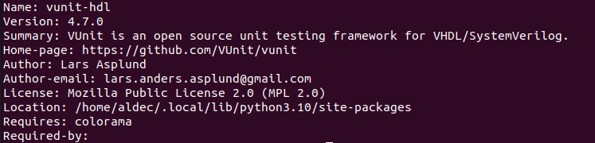

Next, navigate to '<vunit_hdl_location>/vunit/sim_if' and replace the 'factory.py' and 'rivierapro.py' filers with the versions located in the 'aes-encryption/patch' directory of this project.

Once the replacement is complete, uncomment line 92 in the 'run.py' script to enable logic profiling.

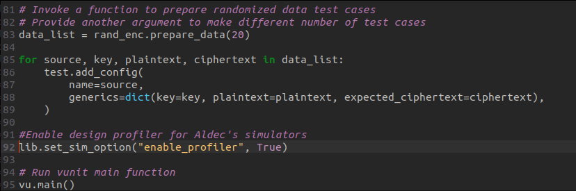

Afterward, you can generate profiled data by running the example. When the example finishes, launch the Riviera-PRO simulator from the 'aes-encryption' directory. In the Riviera-PRO GUI console, enter the following command:

```console
profiler report -tbp $curdir/vunit_out/test_output/<specific_test_directory>/rivierapro/Profiler/profiler.tbp -html profiler_report.html
```

This command will generate a 'profiler_report.html' file in the 'aes-encryption' directory, which you can open by either double-click it to open it in Riviera or navigate to the example directory and open it via your default browser.

Below is an example of the data profiling results:


The profiler report offers valuable insights into the performance of each process in the design, showing how the CPU is utilized during simulation. The percentage report indicates which module requires the most processing time, along with its location and clock ticks. During simulation, the profiling engine tracks CPU ticks for each HDL statement, design unit, or instance of a design unit. The tick counts collected can demonstrate the time needed to simulate any part of the code. Profiling data helps identify design units or code sections that put the greatest pressure on the simulator. This information is crucial for optimizing the simulation environment and enhancing performance, potentially making the simulation process more efficient.

For further information, please visit [this page](https://www.aldec.com/resources/manuals/Riviera-PRO/cmd_asim.htm#profiler).

## Data Profiling with Active-HDL

Similar to Riviera-PRO, generating a profiler report in Active-HDL requires applying a special patch, followed by running and completing a simulation at least once.

First, apply the necessary patch starting with finding the location of 'vunit_hdl' package.

```console
pip show vunit_hdl
```

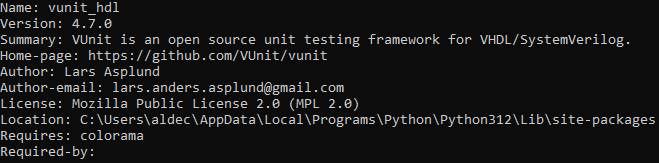

Replace files named 'factory.py' and 'activehdl.py' in <vunit_hdl_location>/vunit/sim_if directory with the files with the same name that are present in the aes-encryption/patch directory in the project.

Next, navigate to the run.py file and uncomment line 92 to enable data profiling in Active-HDL.


Run the run.py script in GUI mode using:

```console
python run.py -g
```

Once Active-HDL opened use it's console to run the simulation. Type:

```console
run -all
```


Then stop the simulation using endsim command.

```console
endsim
```


After finish of the simulation profiler results were written to specific folder. Generate profiler report from obtained file using Active-HDL command prompt. In this case profiler report will be generated in the HTML format, but it is possible to change it to other formats.

```console
profiler report -tbp $dsn/../../../Profiler/profiler.tbp -html $dsn/../../../Profiler/<profiler_report_name>.html
```

Profiler report will be stored in the aes-encryption/vunit_out/test_output/<specific_test_directory>/Profiler directory. Example view of the profiler report is shown below.


For further assistance with Active-HDL profiler, please watch the [demonstrating video](https://www.youtube.com/watch?v=aIdbI7J9DJg) about it.

# Results and Benefits

The testing time varies depending on the hardware and may differ between different machines. In this case, all tests were conducted on the same machine. A total of 27 test cases were executed: one hardcoded test, six tests created using generics and input data from references, and 20 randomized tests. Here are the results.

## Results for Riviera-PRO

Using a single Riviera-PRO license file and conducting testing with one thread, the entire
process takes approximately 33 seconds.


Utilizing the same script with two threads reduces the testing time to around 16 seconds,
showcasing a two times performance boost.


Further enhancing the testing environment with three threads reduces verification time to 10
seconds.

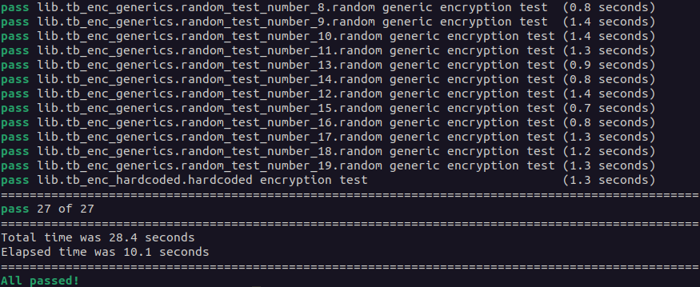

Using five Riviera-PRO licenses and employing five threads produces even better results,
with testing completing in about 7 seconds. This is almost five times faster than single-
threaded testing.

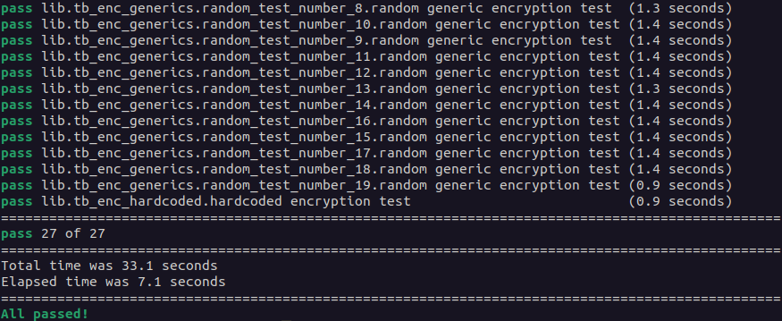

Running the script with 15 threads significantly decreases simulation time.


Utilizing 30 threads leads to testing completion in less than 2 seconds.

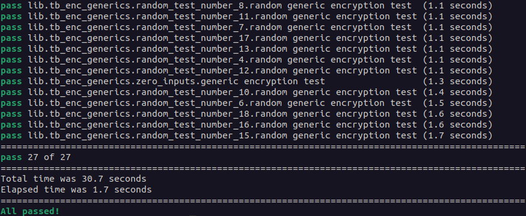

## Results for Active-HDL

Running the test with Active-HDL using only one thread causes the entire testing process to take 20 seconds.


Using two threads to enable more simultaneous calculations reduces the test duration to approximately 10 seconds.

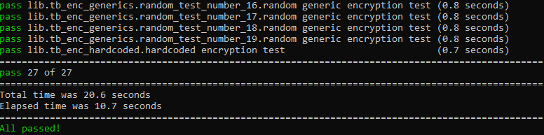

When utilizing three threads, the testing process takes around 7 seconds to complete, making it almost three times faster than using a single thread.

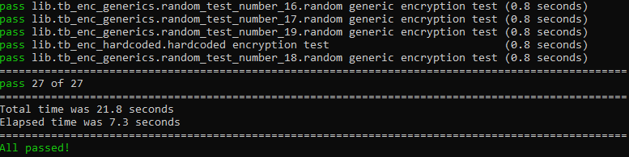

Increasing to 5 threads further reduces the test duration to around 5 seconds.


With 15 threads, the test completes in 3.7 seconds.

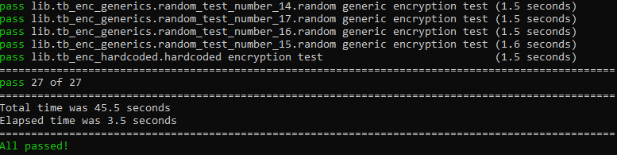

Running 30 test cases simultaneously results in the test finishing in 3.5 seconds. However, this is not linearly efficient, as each of the 27 tests lasts longer due to the overhead of managing multiple threads.

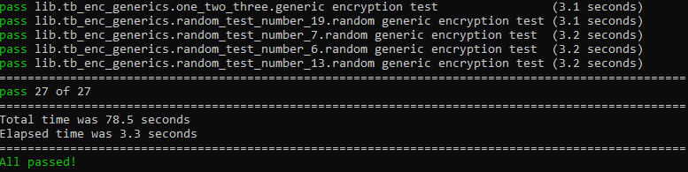

## Conclusions and Benefits

This example demonstrates how VUnit significantly improves the efficiency of the verification process, potentially transforming tasks that previously took months into workflows that can be completed in weeks or even days. By leveraging multithreaded simulation and automation features, VUnit optimizes testing, allowing multiple testbenches to run concurrently, thus speeding up the overall verification timeline.

Aldec simulators, such as Riviera-PRO and Active-HDL, further enhance performance by providing a profiler tool that helps identify bottlenecks in the design. This allows developers to pinpoint areas for improvement and optimize both the simulation and the testbench code. When used in conjunction with VUnit, these simulators enable a deeper analysis of resource utilization, facilitating more efficient troubleshooting and performance optimization.

Key benefits include:

- Faster Verification Cycles: The combination of VUnit's multicore simulation capabilities and the loop-unrolled AES implementation accelerates testing. This allows for significant reductions in verification time while maintaining accuracy.
- Scalability and Flexibility: The use of generics-based and randomized tests, along with support for multiple testbench files, ensures that the verification process is scalable and adaptable to different testing scenarios.
- Comprehensive Profiling: Aldec’s built-in profiling tools allow for real-time performance monitoring, enabling users to make data-driven optimizations. This is especially useful for large designs where pinpointing bottlenecks can dramatically improve simulation throughput.
- Automation and Customization: Automated test generation, especially with randomized inputs, increases coverage and reduces manual effort. The Python integration simplifies the orchestration of test cases, enabling seamless test execution and result analysis.
- Resource Efficiency: By distributing tests across multiple threads, VUnit maximizes the computational power of the host machine, making it essential to match the testbench complexity and thread count with the machine’s processing capacity for optimal performance.

To fully utilize these benefits, ensure the appropriate number of simulator licenses, especially when running multithreaded simulations, as each thread requires a license. The performance is influenced by factors such as the host machine's processor, number of threads, and the complexity of the testbenches, but with the right configuration, VUnit and Aldec simulators offer a highly efficient, scalable, and robust verification solution.

---
**NOTE**

It's important to understand that in this project most of the testing time in VUnit is spent launching the simulator. While VUnit delivers ultra-fast testing for trivial testbenches, more complex ones will naturally extend the overall test duration beyond the simulator launch time.

Moreover, a noticeable difference in simulator launch times can be observed between Riviera-PRO and Active-HDL, with Riviera-PRO taking slightly longer to initialize. This is especially evident when running tests with fewer threads (up to 5), as demonstrated in the provided screenshots.

---

# Revised Example

For detailed guidance on adding additional test cases, selecting specific tests, or integrating test suites across one or multiple projects, refer to the third entry in Aldec's VUnit blog series. This blog covers essential modifications, such as adjusting the number of tests, tailoring the testing approach to fit your needs, and incorporating new tests. You can explore these practical steps in more detail  [here](https://www.aldec.com/en/company/blog/196--navigating-vunit-a-practical-guide-to-modyfing-testing-approaches).


# Creating Own Example

To create your own example, follow the guidelines provided on the official VUnit [website](https://vunit.github.io/user_guide.html) and Aldec's [blog](https://www.aldec.com/en/company/blog/195--introduction-to-vunit) on VUnit. 

# Known Facts

1. VUnit Deprecation Notice (Version 4.7.0):

The use of the compile_builtins=False argument is deprecated as of VUnit 4.7.0 and will be removed in version 5.0.0. If you do not specify this argument in the Python run-script, a warning will be displayed:

```console
WARNING - Option 'compile_builtins' of methods 'from_args' and 'from_argv' is deprecated.
In future releases, it will be removed and builtins will need to be added explicitly.
To prepare for upcoming changes, it is recommended to apply the following modifications in the run script now:

* Use `from_argv(compile_builtins=False)` or `from_args(compile_builtins=False)`.
* Add an explicit call to 'add_vhdl_builtins'.

See https://github.com/VUnit/vunit/issues/777.
```

To future-proof your implementation, it's advisable to stop using compile_builtins=False in your scripts. For further guidance, see the detailed issue at [this link](https://github.com/VUnit/vunit/issues/777).

2. Multithreading with VUnit:

When using the -p flag in a Python run-script, VUnit does not impose a hard limit on the number of threads. It attempts to create the specified number of threads as long as there are enough test cases to run. In some instances, simulations may encounter I/O bottlenecks, and the operating system may switch to another thread, which can enhance performance.

However, adding too many threads can result in performance degradation due to the overhead required to manage them. Therefore, it is recommended to match the number of threads to the complexity of your testbench and the capacity of your host machine.

[comment]: References

[1]: https://link.springer.com/book/10.1007/978-3-662-04722-4


